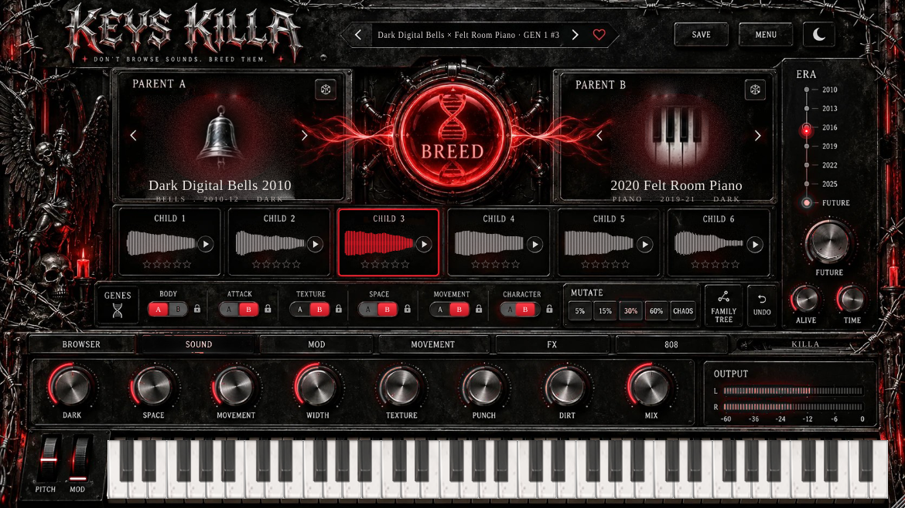
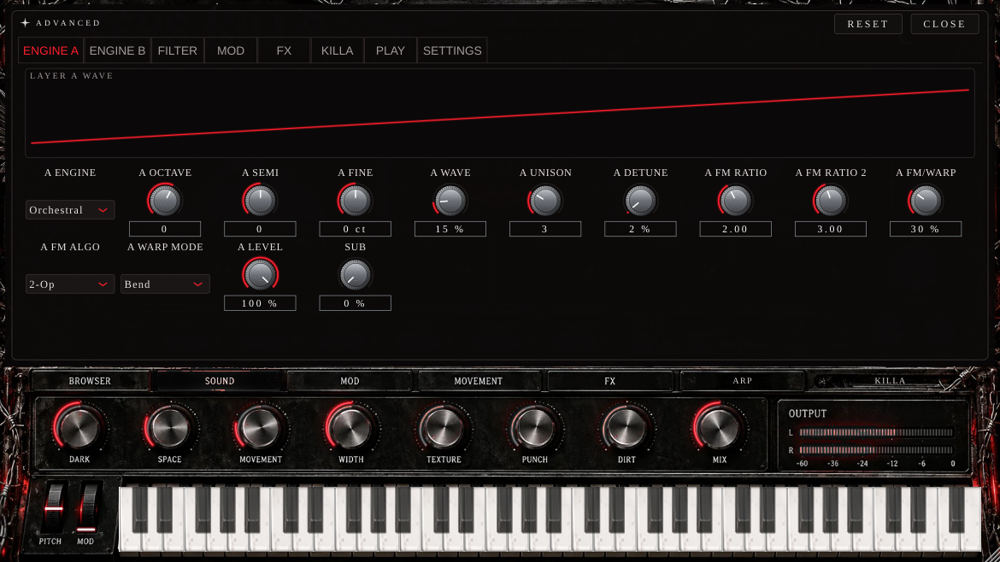

# KEYS KILLA

**Don't browse sounds. Breed them.** – trapový VST3 / AU / Standalone nástroj (JUCE 8, C++20, CMake) od výrobce 808 KILLA.
Všechny zvuky generuje plugin sám syntézou, žádné samply.



## Verze 0.18

- Vlevo: BREED LAB, FAMILY TREE a pod tím doplňky jen pro melodie: VOODOO KILLA, EFFECTOR KILLA, DIGGA KILLA (originální design a funkce).
- Dole jen bicí: 808 | SNARE / CLAP | HI-HAT - každá záložka má vlastní barevný design.
  Přetáhni svůj WAV (z FL), boostni ho (GAIN, PITCH, PUNCH, SUB/BODY/AIR, TONE/SNAP, DRIVE TAPE/TUBE/FOLD, CLIPPER, LENGTH, ROOM, WIDTH, DE-RES),
  hraj ho na klávesách (808 je naladěná podle své noty) a hotový WAV přetáhni zpátky do channel racku.
- HI-HAT má i generátor rollů (tlačítko ROLLS).
- PARAMS jsou v MENU.

## Originální KILLA pluginy uvnitř (verze 0.17)

- **HALF** = celý **Voodoo Killa** (jeho design i všechny funkce) - jen na melodie (KEYS KILLA + DIGGA). Funguje, když hraje FL.
- **EFFECTOR** = celý **Effector Killa** (kazety, TV) - jen na melodie.
- **DIGGA** = celý **Digga Killa** - samplování; tlačítko PLAY DIGGA ON KEYS pošle klávesy do Diggy.
- **HI-HAT** = generátor rollů (MIDI na tvůj hi-hat ve FL).
- **808** a **SNARE / CLAP** = úprava tvých bicích z FL (další verze), žádné vlastní zvuky.
- Bicí nikdy nejdou přes HALF ani EFFECTOR.

## SOUND WORLD (verze 0.16)

Tlačítko **WORLD** v hlavičce: jedním klikem obarví celý zvuk jako XV (90s PCM), MOOG, SERUM (OTT), ZENOLOGY, OMNI, KONTAKT, DIVA nebo NEXUS - hlasitost zůstává stejná.
Ve stejném menu **TRANCE GATE** (1/8, 1/16, triplety, stutter) a **CLIPPER** (Soft / Hard / Modern) na celý výstup.
808: **SUB** (suboktáva fázově zamčená). ROLLS: humanizace ±1.5 dB, **AUTO-PAN** v tempu, de-resonátor 4 kHz.

## Moduly (verze 0.15)

- **808** - laděná 808 se slidy (překryj dvě noty v piano rollu), PUNCH, TONE, GLIDE + 808 Killa DRIVE / SATURATION / CLIP. 10 kitů, BREED = 6 nových 808.
- **SNARE / CLAP** - syntetizované trap snary a clapy, kity, knoby, BREED.
- **ROLLS** - generátor hi-hat rollů (CLASSIC / TRIPLET / DRILL / CRAZY, 1-4 takty), PLAY, WITH FL (hraje s FL v tempu), přetažení patternu do FL jako MIDI.
- **EFFECTOR** - Effector Killa: 12 kanálů x 8 hotových řetězců efektů, 5 maker, BLEND.
- **DIGGA** - přetáhni sample, rozseká se (podle úderů nebo rovně, 8 / 16), pady a klávesy hrají kousky (C5 = 1), REVERSE, PITCH.
- Tlačítko **PLAY ... ON KEYS** přepne, co hrají klávesy / MIDI z FL (zvuk KEYS KILLA, 808, snare, clap, hi-haty nebo DIGGA). Tip: pro každý nástroj jedna instance KEYS KILLA.

## 10 v 1 (verze 0.14)

KEYS KILLA obsahuje ostatní KILLA pluginy jako moduly - spodní lišta: **808 | SNARE | CLAP | ROLLS | HALF | EFFECTOR | DIGGA**.

- **HALF** = Voodoo Killa (12 kategorií x 8 efektů: halftime, tape stop, glitch, backmask...) na všem, co KEYS KILLA hraje. Klik na kartu = zapnuto.
- Ostatní moduly se stěhují postupně (zatím zástupná stránka).
- Vlevo: **BREED LAB / FAMILY TREE / PARAMS** (PARAMS = všechny parametry zvuku).
- Vpravo: **SOUNDS** - pořád otevřený seznam zvuků (jako FLEX), šipky / klik na název = kategorie.
- ARP a WILD jsou pryč (melodie dělají loopy FAMILY TREE).

## BREED LAB (verze 0.12)

1. **PARENT A + PARENT B** – dva zvuky z knihovny (šipky = další zvuk kategorie, kostka = náhodný, klik = výběr / prohlížeč).
2. **BREED** – 6 dětí najednou. Každé dítě dědí 6 genů (BODY, ATTACK, TEXTURE, SPACE, MOVEMENT, CHARACTER) od jednoho z rodičů,
   spojité hodnoty se trochu přiblíží druhému rodiči, děti 4–6 mají mutaci. Hlasitost a čistý sub u basů hlídá engine.
3. **CHILD 1–6** – skutečná vlna zvuku, ▶ poslech, hvězdičky (4+ se uloží do User / Bred), pravý klik = rodič další generace.
4. **GENES** – A/B přepne gen vybraného dítěte, zámek = všechny další děti ho zdědí.
5. **MUTATE** 5 / 15 / 30 / 60 % / CHAOS, **UNDO**.
6. **FAMILY TREE** (přepínač vlevo: BREED LAB / FAMILY TREE) – vybereš až 4 zvuky (SOUND 1–4), páry se zkříží jako rodokmen
   (1 × 2, 3 × 4 → pak spolu) a BREED uprostřed dá 6 výsledků: režim **SOUND** = 6 nových zvuků, režim **LOOP** = 6 melodických
   smyček (každá s novým zvukem), 8 / 16 taktů, tónina AUTO / C–B. Smyčka hraje v tempu hosta, přetažení karty do FL = MIDI klip.
   Pravý klik: nová melodie, použít jako PARENT A / B, vložit zpět do SOUND 1–4, uložit preset.
7. **Melodie** (Source/Loops.h) – každá se skládá nově ze semínek: paleta 4–6 tónů z molové tóniny s kotevním tónem,
   rytmus na šestnáctinové mřížce s trapovými akcenty (2. takt = obměna 1.), tvar melodie (klesající běh, střídání s kotvou,
   oblouk, prodleva + odpověď, cik-cak), akordový plán, hustota, bas, poloha. Doby 1 a 3 sedí na akordové tóny,
   motiv A A' A A'' a zakončení vede zpět na začátek. Miliardy kombinací, každý BREED = nové melodie.
8. **WILD** (SAFE → CRAZY): jak daleko BREED smí jít – geny přeskakují, přepínače se mění, víc HYBRID dětí (zvuk druhého rodiče jako vrstva B) a FUTURE.
9. **FUTURE**, **ALIVE**, **TIME**, 8 maker DARK · SPACE · MOVEMENT · WIDTH · TEXTURE · PUNCH · DIRT · MIX.
10. Záložky BROWSER · SOUND · MOD · MOVEMENT · FX · **ARP** (16 kroků jako noty: posun ±12 půltónů, délka přes více kroků, pauzy, trapové stupnice Scale Up/Down, Chord, triolové rychlosti) · KILLA; každý panel má **RESET** (vrátí zvuk, jak byl nahraný).

## Engine

| Oblast | Obsah |
|---|---|
| **Enginy** (vrstva A + B) | VA (PolyBLEP, unison až 8), FM (4 operátory, 6 algoritmů, feedback), Wavetable (8 tabulek, mip-mapping, warp Bend/Sync/Mirror/Quantize/FM), Pluck (Karplus-Strong), Modal (kalimba / marimba / zvon), Vox (formanty A-E-I-O-U), Organ (additive), Flute, Orchestral (brass / strings / choir hity), Sub 808 |
| **Filtr** | Clean, Ladder, Dirty, High Pass, Band Pass; key tracking; obálka 2 |
| **Modulace** | 3 ADSR obálky, 2 LFO (sync, 5 tvarů), mod matrix 8 slotů (Env 2/3, LFO 1/2, velocity, mod wheel, aftertouch, key track, random → pitch, cutoff, reso, wave A/B, FM A/B, level A/B, amp, pan, sub, detune) |
| **Hraní** | 16 hlasů, Mono / Legato + glide, pitch bend range, sustain, aftertouch (channel i poly), **Key Lock** (tónina + 8 stupnic, zobrazeno na klaviatuře), **CHORD** (10 typů, výchozí trapové voicingy Trap Minor / Dark Minor / Minor Add9…, strum), **ARP** (Up/Down/Up-Down/Random/As Played, 1–3 oktávy, swing, gate, sync) |
| **Bass režim** | mono, sub vrstva, mono pod 120 Hz, subsonic filtr 22 Hz, Clean Low distorze, makra SUB/WOBBLE/DIRT/GLIDE/TONE/PUNCH, wobble cíl filtr/hlasitost/wave/pitch, varování při přebuzení |
| **FX rack** (pořadí přetahovatelné) | Drive (Soft/Tape/Hard/Blown/Fold, 2× oversampling), Body Swap, Lo-Fi (bitcrush, SR, wow/flutter, vinyl), Circuit Bend, Chorus, Phaser, Flanger, EQ, Delay (ping-pong/stereo/tape), Reverb (hall/plate/cloud, freeze), Reverse, Width |
| **EXCLUSIVE** | DICE + CHAOS (zámky sekcí, historie 20 hodů, uložení jako preset – pravý klik), ERA MORPH (XY pad, do rohů lze vložit presety a míchat je, jinak mění charakter), GHOST (obrácený stín ±oktáva, blur), BEND (dive/rise/dip/octave jump/random + broken tape), CIRCUIT (glitche v tempu, deterministické), BODY SWAP (6 těles) |
| **Presety** | **516 factory presetů**: 10 dlaždic + podkategorie Piano, Organs, Strings, Brass, Guitars, Mallets, Arps; éry 2010–2026, Experimental, Exclusive (72), Bass (105); varianty Lo-Fi / Dark / Blown; hlasitost srovnaná na −15 dB |
| **Správa presetů** | prohlížeč s vyhledáváním a filtry (kategorie, éra, exclusive, oblíbené, user), Save / Save As / Rename / Delete, `*` při změně + Revert, A/B, Undo/Redo, Init, import/export packů (.zip), JSON formát s verzí |
| **GUI** | postavené přímo z předlohy designu (`assets/src/breed.webp`, `tools/make_breed_assets.py`), skin BLOOD, velikost 50–100 % (výchozí 70 %), panel CHORD / ARP, ADVANCED se záložkami ENGINE A/B, FILTER, MOD, FX, EXCLUSIVE, PLAY, SETTINGS, vizualizace vlny, obálek a LFO, tooltip u každého prvku, dvojklik = default, Ctrl + tah = jemně |
| **Technika** | klávesnice zůstává hostiteli (mezerník = play/stop), rychlé otevření editoru, žádné alokace v audio threadu, deterministický render (export = přehrávání), bypass s fade, tail 10 s, 44,1–192 kHz, Eco režim |



## Test ve FL Studiu (Windows)

1. GitHub → **Actions** → poslední běh `build` → stáhni **KEYS-KILLA-Windows-Installer** (instalátor) nebo **KEYS-KILLA-Windows-VST3**.
2. Instalátor dá plugin do `C:\Program Files\Common Files\VST3\`. Ručně: zkopíruj složku `KEYS KILLA.vst3` tamtéž.
3. FL Studio → *Options → Manage plugins → Find installed plugins* → KEYS KILLA (výrobce 808 KILLA) → Channel Rack.

## Build a testy

```bash
cmake -B build -DCMAKE_BUILD_TYPE=Release        # JUCE se stáhne automaticky (nebo -DKK_JUCE_DIR=cesta)
cmake --build build --config Release
./build/KeysKillaTests_artefacts/Release/KeysKillaTests          # unit testy + render všech presetů
./build/KeysKillaTests_artefacts/Release/KeysKillaTests -bench   # CPU, 8 not
pluginval --strictness-level 10 --validate "build/KeysKilla_artefacts/Release/VST3/KEYS KILLA.vst3"
python3 tests/calibrate.py build/KeysKillaTests_artefacts/Release/KeysKillaTests   # přepočet hlasitosti presetů
```

## Distribuce

- Windows: `installer/win/keyskilla.iss` (Inno Setup) – staví CI.
- macOS: `installer/mac/build_pkg.sh` – `.pkg` s VST3 + AU + Standalone, Universal Binary. Podepíše a notarizuje,
  když jsou v GitHubu nastavené secrets `MAC_APP_SIGN_ID`, `MAC_INST_SIGN_ID`, `NOTARY_APPLE_ID`, `NOTARY_TEAM_ID`, `NOTARY_PASSWORD`.
- Identita: výrobce **808 KILLA**, kód výrobce **Kila** (stejný jako 808 KILLA), kód pluginu **Kkey**. Nikdy neměnit.
- Verze je jen v `CMakeLists.txt` (`project(KEYS_KILLA VERSION …)`).
