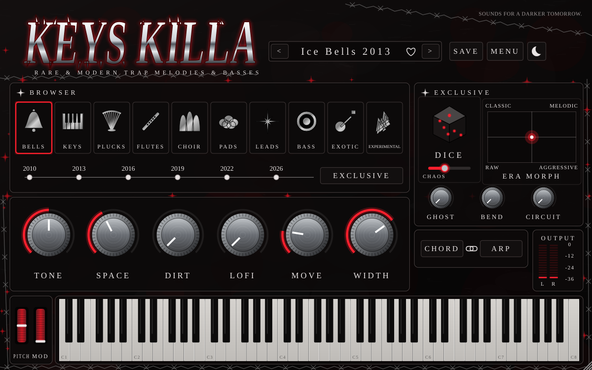

# KEYS KILLA

*rare & modern trap melodies & basses* – VST3 / AU / Standalone syntezátor (JUCE 8, C++20, CMake).
Všechny zvuky generuje plugin sám syntézou, žádné samply.



## Stav: testovací verze 0.1

| Oblast | Hotovo v 0.1 |
|---|---|
| Enginy | VA (PolyBLEP, unison až 7), FM (2-op + feedback), Pluck (Karplus-Strong), Vox (formanty A/E/I/O/U), Organ (additive 8 harmonických), Flute (sinus + dech), Sub/808 (pitch drop) |
| Hraní | 16 hlasů, Mono/Legato + glide, sustain pedál, pitch/mod wheel, CHORD (m7), ARP (sync s tempem, pravý klik = rychlost) |
| Bass režim | presety BASS: mono, sub vrstva, mono pod ~120 Hz, Clean Low distorze, makra SUB/WOBBLE/DIRT/GLIDE/TONE/PUNCH, varování při přebuzení |
| FX | Drive (Soft/Tape/Hard/**Blown**/Fold, 2× oversampling), Lo-Fi (bitcrush, SR reduction, wow/flutter, vinyl), Chorus, ping-pong Delay (sync), Reverb, Width |
| EXCLUSIVE | DICE + CHAOS (pravý klik = undo), ERA MORPH XY pad, GHOST (obrácený stín o oktávu výš), BEND (scoop, dive na konci noty, broken tape), CIRCUIT (glitche synchronizované s tempem, deterministické), BODY SWAP (v ADVANCED) |
| Presety | 81 factory presetů (všech 10 dlaždic, éry 2010–2026, Experimental, Exclusive), hlasitost srovnaná na ±1,5 dB; ukládání/načítání `.kkpreset`, oblíbené |
| GUI | hlavní stránka podle předloh, skiny CHROME / BLOOD (☀/☾), 100–200 % zoom, tooltips, dvojklik = default, Ctrl+tah = jemně; ADVANCED stránka se všemi parametry (MENU → ADVANCED) |

Zatím chybí (další fáze): wavetable a orchestral engine, vrstvy A+B, mod matrix, Key Lock, rohy ERA MORPH s vlastními presety, záložky ADVANCED, 240+ presetů, instalátory a podpis.

## Test ve FL Studiu (Windows)

1. GitHub → **Actions** → poslední běh `build` → artefakt **KEYS-KILLA-Windows-VST3** → stáhnout a rozbalit.
2. Složku `KEYS KILLA.vst3` zkopírovat do `C:\Program Files\Common Files\VST3\`.
3. FL Studio → *Options → Manage plugins → Find installed plugins* → KEYS KILLA (Generators) → přidat do Channel Racku.

## Build lokálně

```bash
cmake -S . -B build -DCMAKE_BUILD_TYPE=Release      # JUCE se stáhne automaticky (nebo -DKK_JUCE_DIR=cesta)
cmake --build build --config Release
./build/KeysKillaTests_artefacts/Release/KeysKillaTests   # offline render všech presetů (NaN, ticho, DC, hlasitost)
pluginval --strictness-level 10 --validate "build/KeysKilla_artefacts/Release/VST3/KEYS KILLA.vst3"
```

`tests/calibrate.py` přepočítá hlasitost presetů (`python3 tests/calibrate.py <cesta k KeysKillaTests>`).

## Identita pluginu

Jméno výrobce a 4znakové kódy jsou v `CMakeLists.txt` (`KK_COMPANY_NAME`, `KK_MANUFACTURER_CODE`, `KK_PLUGIN_CODE`).
**Teď jsou tam dočasné hodnoty** – před první veřejnou verzí je nahraď skutečnými (kód výrobce stejný jako u 808 KILLA) a pak je už nikdy neměň.
